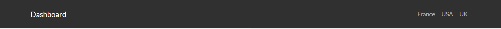

# Introduction

Dans le cadre du module "*Data engineering*" (**DSIA-4201C**), nous avons eu l'opportunité de réutiliser les notions de langage Python abordées dans le cours pour produire un Dashboard sur des sites que nous avons choisi. Le travail a été réalisé en trinôme.

Nos responsables sont Monsieur **Raphaël COURIVAUD** et Monsieur **Jean-Baptiste KOUEK**, et notre trinôme est composé de Mademoiselle **Andrianihary RAZAFINDRAMISA**, de Mademoiselle **Dune CLARET** et de Mademoiselle **Xianli LI**.
  
Nous avons choisi de travailler sur les sites suivants :
- *[Le Syndicat national de l’édition phonographique (SNEP)](https://www.snepmusique.com)*
- *[The 50 best-selling albums of all time](https://www.businessinsider.com/50-best-selling-albums-all-time-2016-9?IR=T#1-eagles-their-greatest-hits-1971-1975-50)*
- *[Gold & Platinum - RIAA](https://www.riaa.com/gold-platinum/?tab_active=awards_by_album#search_section)*

#### Problématique
Nous voulions suivre l'évolution des albums les plus vendus dans le monde et voir si une tendance se dessinait. Nous avons donc choisi de répondre à la problématique : <ins>*Y a-t-il une tendance dans l'évolution des albums les plus vendus dans le monde ?*</ins>

<br>

___

# Table des matières

[[_TOC_]]
___


# I. Guide utilisateur

## 1. Installation & Téléchargement

### A. Python
Dans un premier temps, afin d'exploiter notre projet, il est nécessaire de télécharger et installer le langage de base ***Python v3.X.X*** sur votre appareil. Pour cela, que votre appareil soit sous Linux, macOS, Windows ou autre, vous pouvez trouver la page de téléchargement de Python en cliquant [ici](https://www.python.org/downloads/), puis suivre les instructions d'installation.

Après l'installation, vérifiez le fonctionnement sur votre appareil en tapant les commandes suivantes sur le terminal, l'nvite de commandes, le PowerShell ou autre selon votre système d'exploitation:

```bash
$ python3 --version
Python 3.X.X
```

ou

```bash
$ python --version
Python 3.X.X
```

Dans le cas où vous n'avez pas ***Python v3.X.X*** en résultat, il faut réinstaller Python.

### B. *pip*

Dans un second temps, des packages supplémentaires sont nécessaires au bon fonctionnement de notre projet. Il faudra alors installer *pip* (si la version de Python est plus ancienne que **Python 2.7.9** ou **Python 3.4**) grâce à ce [lien](https://pip.pypa.io/en/stable/installing/).

### C. Le dashboard

#### Télécharger le projet

Le projet se trouve sur un dépôt Git se situant sur [cette page](https://github.com/Xianlilxl/projet_data_engineering). Ce dépôt pourra être "*cloné*" dans un répertoire de travail que vous avez déjà créé sur votre ordinateur.

#### Packages nécessaires

Des packages supplémentaires sont nécessaires au bon fonctionnement de notre projet. Le nom de ces packages sont disponibles dans le fichier *requirements.txt* :

```bash
re
scrapy
dash
dash_bootstrap_components
dash_core_components
dash_html_components
pandas
plotly
scipy
pymongo
itemadapter
selenium
```

On peut utiliser les commandes suivantes pour les télécharger et les installer :

```bash
pip install -r requirements.txt
```

```bash
pip3 install -r requirements.txt
```

```bash
python -m pip install -r requirements.txt
```

```bash
python3 -m pip install -r requirements.txt
```

## 2. Exécution

### A. Windows

Lancez un invité de commande/cmd/powershell puis placez-vous dans le dossier du projet:

- Sous CMD
```shell
> CD [Le chemin menant au dossier]
> DIR
...
```

- Sous powershell
```shell
> cd [Le chemin menant au dossier]
> ls
README.md     main.py     ...
```

On peut utiliser les commandes suivantes pour lancer l'application :

```bash
$ python main.py
$ python dash/main.py
```

### B. Linux & macOS
Lancez un terminal/invité de commandes/console au niveau du projet:
```bash
$ cd [Le chemin menant au dossier]
$ ls
README.md     main.py     ...
```

On peut utiliser les commandes suivantes pour lancer l'application :
```bash
$ python3 main.py
$ python3 dash/main.py
```


Une fois exécuté, vous devriez voir cet affichage :
```bash
$ python3 main.py
Dash is running on http://127.0.0.1:8050/

 * Serving Flask app "main" (lazy loading)
 * Environment: production
   WARNING: This is a development server. Do not use it in a production deployment.
   Use a production WSGI server instead.
 * Debug mode: off
 * Running on http://127.0.0.1:8050/ (Press CTRL+C to quit)
```

## 3. Utilisation

Une fois éxécuté, le "*dashboard*" est accessible à l'adresse [http://127.0.0.1:8050/](http://127.0.0.1:8050/).

### A. Bar de navigation

Lorsque l'installation et l'éxecution ont bien été respéctées, on se retrouve sur la page suivante:  



Il y a trois pages :
- *France*,
- *USA*,
- et *UK*.
<br>
Ces pages sont accessibles en cliquant sur leur label, en haut à droite de la page.

### B. *France*

Une fois l'installation et l'exécution réussies, l'application s'ouvre sur la page suivante:


#### Top 10 best-selling albums

- ##### Partie principale : Top 10


La partie gauche de la page présente les boutons correspondant aux dix albums les plus vendus en France. Ces boutons ouvrent sur une page secondaire contenant les informations de l'album correspondant.  

- ##### Page secondaire : Information sur l'album choisi


La fenêtre secondaire est une fenêtre qui donne accès à plus d'informations sur un album spécifique :
- Le titre,
- L'artiste,
- L'année de parution,
- Le genre,
- Le nombre de ventes,
- Et le prix de l'album en CD sur Amazon.
<br>
Cela permet d'avoir accès à la fiche d'identité de l'album.

#### Graphs and statistics

- ##### Premier graphique


La partie supérieure de la page affiche un "*scatter*" du prix en fonction du nombre de certifications. Cela permet de voir la corrélation entre le nombre de ventes et le prix.  

- ##### Second graphique


La partie inférieure de la page affiche un histogramme du nombre d'albums par genre, en fonction du temps. Cela permet de mettre en évidence des tendances et modes musicales.

### C. *USA*


#### Top 10 best-selling albums

- ##### Partie principale : Top 10


La partie gauche de la page présente les boutons correspondant aux dix albums les plus vendus en France. Ces boutons ouvrent sur une page secondaire contenant les informations de l'album correspondant.  

- ##### Page secondaire : Information sur l'album choisi


La fenêtre secondaire est une fenêtre qui donne accès à plus d'informations sur un album spécifique :
- Le titre,
- L'artiste,
- L'année de parution,
- Le genre,
- Le nombre de ventes,
- Et le prix de l'album en CD sur Amazon.
<br>
Cela permet d'avoir accès à la fiche d'identité de l'album.

#### Graphs and statistics

- ##### Premier graphique


La partie supérieure de la page affiche un "*scatter*" du prix en fonction du nombre de certifications. Cela permet de voir la corrélation entre le nombre de ventes et le prix.  

- ##### Second graphique


La partie inférieure de la page affiche un histogramme du nombre d'albums par genre, en fonction du temps. Cela permet de mettre en évidence des tendances et modes musicales.

### D. *UK*


#### Top 10 best-selling albums

- ##### Partie principale : Top 10


La partie gauche de la page présente les boutons correspondant aux dix albums les plus vendus en France. Ces boutons ouvrent sur une page secondaire contenant les informations de l'album correspondant.  

- ##### Page secondaire : Information sur l'album choisi


La fenêtre secondaire est une fenêtre qui donne accès à plus d'informations sur un album spécifique :
- Le titre,
- L'artiste,
- L'année de parution,
- Le genre,
- Le nombre de ventes,
- Et le prix de l'album en CD sur Amazon.
<br>
Cela permet d'avoir accès à la fiche d'identité de l'album.

#### Graphs and statistics

- ##### Premier graphique


La partie supérieure de la page affiche un "*scatter*" du prix en fonction du nombre de certifications. Cela permet de voir la corrélation entre le nombre de ventes et le prix.  

- ##### Second graphique


La partie inférieure de la page affiche un histogramme du nombre d'albums par genre, en fonction du temps. Cela permet de mettre en évidence des tendances et modes musicales.

# II. Guide développeur

Dans ce Developper Guide, la structure, le code et le rôle des fichiers dans le projet seront expliqués.

## 1. La structure 

Notre projet contient 3 dossiers ainsi que 3 fichiers qui sont localisés au même niveau.

### A. *Dossiers*

#### a. *images*

Ce répertoire contient les images servant principalement à la rédaction de ce guide.

#### b. *baby_yoda*

Ce répertoire contient les fichiers permettant de faire les recherches et la récupération des données sur Internet.

##### - webdriver.py

Ce fichier prend le même rôle que des spiders. Il cherche des informations supplémentaires en ligne, par exemple le prix, l'année et le genre musical d'un album. Il contient seulement une fonction qui sera appelée dans le main.

##### - middlewares.py

Le middleware permet de traiter les demandes et les éléments générés par les spiders en gérant différents types d'éléments avec une seule interface. 

##### - items.py

 L'objectif principal du scraping est d'extraire des données structurées à partir de pages Web. Les spiders peuvent renvoyer les données extraites sous forme d'items. Ce fichier définit les modèles des "scraped items".

##### - pipelines.py

Ce fichier définit les pipelines des items.
Une fois qu'un item a été scrapé par un spider, il est envoyé au pipeline des items qui le traite via plusieurs composants qui sont exécutés séquentiellement.
Chaque composant de l'item pipeline est une classe python qui implémente une méthode simple. Ils reçoivent un élément et effectuent une action dessus, décidant également si l'élément doit continuer dans le pipeline ou être abandonné.
Les pipelines valident notamment les données récupérées, suppriment les doublons, et stockent l'élément récupéré dans une base de données.

##### - settings.py

Ce fichier s'occupe des paramètres Scrapy du projet, en configurant les item pipelines et en respectant les règles du fichier robots.
Les paramètres Scrapy permettent de personnaliser le comportement de tous les composants Scrapy, y compris les pipelines et les spiders.
L'infrastructure des paramètres fournit un espace que le code peut utiliser pour extraire des valeurs de configuration. Les paramètres peuvent être renseignés via différents mécanismes.


##### - Spiders

- Top 10 en France, composé de deux spiders (le site français ne présentait pas de classements lorsque l'on sélectionnait les certifications les plus hautes. Il a donc fallu faire deux sélections pour avoir les 10 albums les plus vendus),

- Top 10 au Royaume-Uni, contenant le spider pour le site britannique,

- et le top 10 aux USA, contenant le spider pour le site américain.

#### c. *dash*

Ce répertoire contient les fichiers permettant de créer l'interface graphique et d'implémenter le traitement dynamique des données en créant une interactivité entre les différents composants de l'application.

Dans cette section, on crée l'interface de l'application en définissant le contenu du menu et du corps de l'application. 


##### - La création des graphes : navigation_bar.py

Ce fichier construit le bar de navigation qui se situe en haut de l'interface et permet de naviguer entre les pays.

##### - La création des graphes : france.py

Ce fichier construit la page dédiée aux top albums français.

##### - La création des graphes : uk.py

Ce fichier construit la page dédiée aux top albums britanniques.

##### - La création des graphes : usa.py

Ce fichier construit la page dédiée aux top albums américains.

##### - La création des graphes : requests_mongo.py

Ce fichier contient la fonction get_graphes qui va créer trois graphiques pour un pays, il crée un curseur qui sélectionne les items associés au pays :

1. fig_sell_price : ce premier graphique affiche le prix par rapport au nombre de ventes, 

2. fig_genre_number : ce deuxième graphique est un histogramme du nombre d'albums par genre, 

3. fig_year : ce troisième graphique est la répartition des albums dans le temps, par intervalle de cinq ans.

#### - Le serveur de l'application : main.py

Ce fichier :

- définit le setting de scrapy : les informations basiques pour déclencher le web scraping,
- se connecte à Mongo,
- déclenche les spiders, qui récupèrent les données en ligne,
- et insère les données récupérées dans le fichier Mongo.

### B. *fichiers*

#### - *chromedriver.exe*

Ce fichier permet de créer le webdriver qui est en charge d'effectuer les recherches sur Chrome.

#### - *main.py*

Ce fichier contient le code permettant le traitement des données afin que l'on puisse les utiliser et les lire clairement. 

#### - *README.md*

Le présent fichier *Markdown* contient:
- la présentation du projet avec la problématique,
- le guide de l'utilisateur avec les instructions d'exécution,
- et le guide du développeur.

